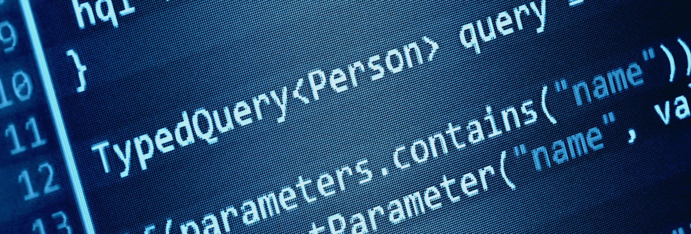

#

Highschool felt like the start of my education. It was certainly the only time I could remember being challenged not for the sake of parents but to be able to compete with several 100 of other classmates. In such a situation, I took part in a lot of clubs, took AP classes, also did sports. However, it didn't felt enough. 

However, one part of my highschool career changed when I joined the Robotics team around my junior year of highschool. In a course of a 2-3 months, a whole new perspective dawned on me,  that working on with a team to build a complex machine first-hand was still touched has influenced my perspective of becoming a ICS major at the University of Hawaii at Manoa. To be honest, the word "complex" would be a over-exagerating since it was not the best amongst all the other schools that competed in FIRST, Hawaii Robotics Competition, but maybe one of the worst one. However, I am still pround on how much was done based on the resources and effort the whole team contributed.

Although I am not the greatest of all students, learning new things about technology and the capabilites of what programming could do pushed my interest into learning a lot more about computer science.

I am now starting to take security classes. I hope to learn a lot through my time at UHM, but I know it will be just the beginning. 

