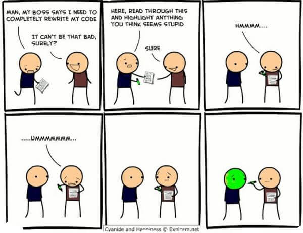

## Coding Standards are useful
This may or not apply to some people but in actuallity, coding standards are very useful for the sake of readability.
Commonly seen in:

1. Coding Conventions -  guidelines for a specific programming language that recommend programming style, practices, and methods for each aspect of a program written in that language. (wiki)
2. Commenting - clear and succninct message that help describe a line or chunk of code.

In terms of readibility, these two may seem insignificant but has a huge role in open-source codes.


## INDENTING IS IMPORTANT?
Indentation is only a small part of the list of coding standards that every programmer agrees on. To those that wonder why? It is because for the sake of readability. Just like in every book, among every chapter, page, paragraph, or sentence we see that their is a clear consise transition between every paragraph and senetence indicated by a (the end of the chapter), (indent), and (period), with spaces in between.

People would hate to read a book if every page was written like this: theboyswaminthelake.

Coding conventions are here so that there is a consistent form of presenting code for others to see. 

Overall, coding conventions are the most trivial tools to a regular programmer, however it one of the most important tools of them all that it is even taught in the beginning of most ICS classes.

As for a software engineer,  ESLint is one coding standard that keeps code in a static convention as well. In my software engineering class we apply this coding standard in our IDE, Intellij, to write Javascript files. For my first time using IntelliJ as a new enviroment, and using ESLint as a coding standard, I feel that coding conventions may have helped me once or twice when writing code, because I sometimes would often have forgotten to use variables i have created, which is where ESLint reminds the user of these kinds of errors. 


## I KNOW WHAT IT DOES...?
As regular programmers, we've been taught how to create meaningful variable names and/or function names. However, in regards to understanding the code in general, is mostly done by comments. Comments are generally helpful for understanding what functions do, without actually reading every line of code. Commenting is both for finished and un-finished code, because hardly any software is maintained for its whole life by the original author. With finished code, it is easy for readers to quickly understand the code without spending thier time tracing their way to understand the same thing as the writer has done. With un-finished it in turn helps programmers see how previous writer's logic went off.

An example of a good commenting:

```javascript
function squared(array) {
  // Creates a subarray for numbers that are perfect squares
  const perfect = _.filter(array, function (number) { return Math.sqrt(number) === Math.ceil(Math.sqrt(number)); });
....
}
```

An example of bad commenting:
```javascript
function squared(array) {
  // Uses filter function from underscore.js.
  // Filters by taking the square root of a number and comparing it to the ceil of the square root
  const perfect = _.filter(array, function (number) { return Math.sqrt(number) === Math.ceil(Math.sqrt(number)); });
...
  // Returns the perfect array and the imperfect array
  return farray;
}
```
Bad comments are plainly just a waste of time of what the reader already knows.

## The GOAL is Readability
"Coding Conventions" readability in actuallity is about for the SAKE OF OTHERS. In comparison, coding style has shift over the years ever since the DARK AGES of C. Code back in the day has a monstrous syntax, causing everyone else but genius' to be confused by the simple look of as single line, while currently, we can are able to get a gist of hundred(s) lines of code or more in about 30 seconds or less.

From adding good comments to optimizing the readability of code through coding convetions can be deemed tediuous at times; software engineers of various skill levels will have different perspectives when to use comments and how they'll choose to structure their code. 

The best part of using coding standards today is that many developer tools eliminated trivial problems so that programmers can focus on the the more difficult problems. 

Using Intellij, with the aid ESLint, overall, has helped me to program logically as well as helped me to format code without the hassle of re-reading code to see that every space and indent is perfectly matched every time, where in IntelliJ, these tasks can be done automatically with a simple click and point with the mouse. Because of coding standards, i dont need to spend my way translating every line of code go through.
