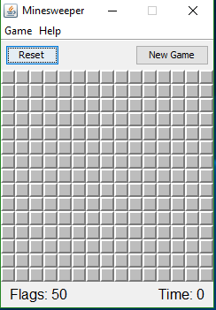
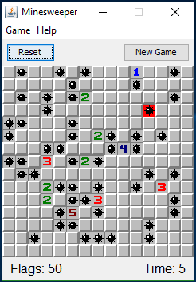

Group members: Ethan Chow and Justin Kam

 
 
 
Minesweeper is a game of chance and guessing. Maybe to the unskilled and first time players it is. 
However, with this source code created by me and my group you will understand how it works, and possibly make it better.
I was in charge of focusing on the front-end design of the game, also along with scheduling, and collaborating with other group mates
that took on the back-end design.

view source code: [Minesweeper](http://www-ee.eng.hawaii.edu/~mmouse/about.html).

