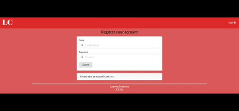

Team members: Collin Wong, Dallas Greene, and Oliver Sou (myself)

My ICS314 group project is a meteor based web application catered to UHM students. Learning Comrades is about getting together with to study together with fellow ICS students who are in the same class, without the awkward social conversation of preparing and scheduling a time to meet, but rather taking the non-social and booking it outline. 

My duties was to help link the database with the respected fields that was required such as name, class name, etc. 

Some complications during this project was using github Desktop because of not only the ui that it had but also how unreasonable it is in notifying which branch you want to commit in. So as a group we had to use git commands to manage the project. 

  

view source code: [Learning Comrades](https://learningcomrades.github.io/).
